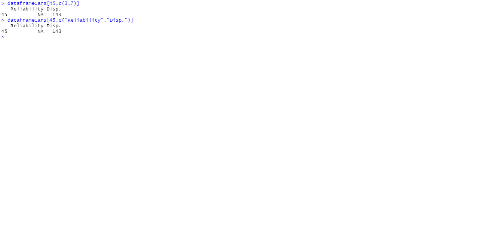

# Using Data ICE

Below is the screenshot for DataFrame Creation

Below is the screenshot for Column names and no.of Rows & Cols

Below is the screenshot for determining which columns are categorical

Below is the screenshot for Unique

Below is the screenshot for Values 

Below is the screenshot for 3 methods for printing rows

Below is the screenshot for 3 methods for printing columns

Below is the screenshot for HP Column

Below is the screenshot for a reliability greater than and equal to 4

Below is the screenshot for a reliability greater than and equal to 3 from Japan but not from the US

Below is the screenshot for No of cars manufactured

Below is the screenshot for a subsample of 70% of your data

Below is the screenshot for a 8-fold cross validation test; save each subsample as a new dataframe

Below is the screenshot for Printing Numeric Columns

Below is the screenshot for Delete Columns

Below is the screenshot for Change Column Name
